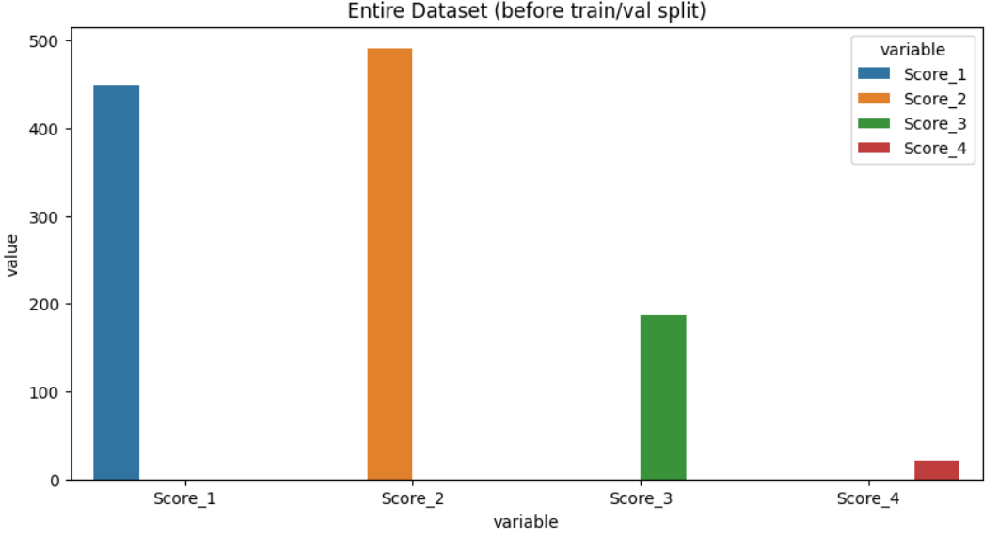
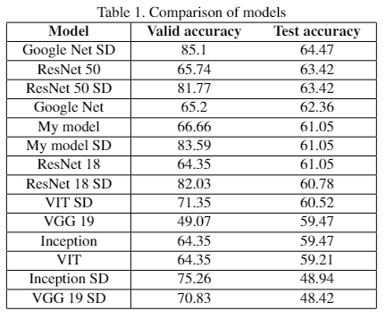

# Cow teat data augmentation using DreamBooth's Stable Diffusion a comparison approach

Cow teat dataset contained the following classes distribution which shows a very high data imbalance between classes. That's why Data Augmentation was important to generated images for under presedented classes such as 1, 4, and 3.

Here is the data distribution of the classes:
Score_1: 450, Score_2: 491, Score_3: 187, Score_4: 21

Tested total 6 models on both the balanced and unbalanced datasets.
The paper can be found <a href="https://www.researchgate.net/publication/370729404_Cow_teat_data_augmentation_using_Stable_Diffusion?_sg%5B0%5D=OEarIc4_Ug2TRjj1-ttlTizgfat__j0KOEtq4oDJj18baNuofqiT0dxabCzyWqM5y_f909TdWX5c-mgk2DVsB3B_HkTGYOVMXvuiF-A7.nlwWOIE8XhEHjfivod5cc4z8ddGc2AWPI7J1Gpg6_CeqSijvkoaFobNXedoV6nUYwbJiThu-K2Z2qfjy63Q6kA"> here </a>

Please reacho out to me for any quesitons or collaboration.

